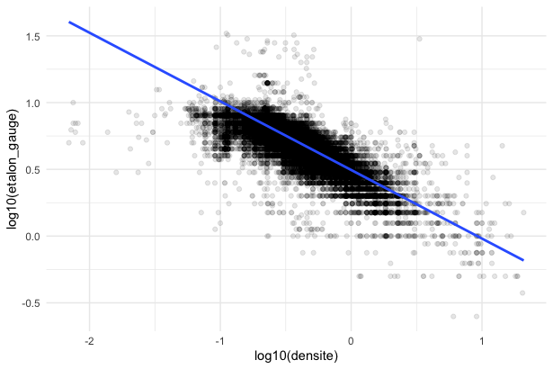
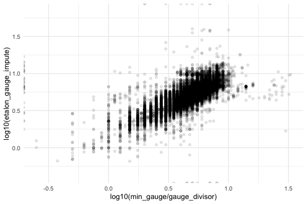

# Analyse de données - Laine

Le script R utilise les bibliothèques **tidyverse** et **tidytuesdayR**. Si elles ne sont pas installées sur votre machine, une fonction les installera au début du script.

## Objectif de l'analyse

L'objectif était d'explorer les données de ce TidyTuesday portant sur un stock de fils de laine avec toutes leurs caractéristiques (grammage, etc). Le problème était qu'il y avait des valeurs manquantes dans ce jeu de données. Le but était de traiter ce jeu de données afin d'avoir des données homogènes, pour pouvoir plus tard appliquer des algorithmes d'apprentissage (IA). Les données ici proviennent du TidyTuesday de la semaine 41 de 2022.

## Exploration des données

Premièrement, on examine la répartition des valeurs manquantes dans la variable **max_gauge** et établit un résumé du taux de valeurs manquantes dans les autres colonnes.

## Traitement des valeurs aberrantes

On traite avec grande attention les valeurs aberrantes qui peuvent fausser toute conclusion/algorithme. Plus particulièrement, les valeurs de **yardage**. Leurs valeurs aberrantes (zéros) sont identifiées et corrigées.

## Filtrage des données

Les données sont filtrées pour exclure les valeurs nulles de **grams** et **yardage**. Une nouvelle variable **dens** est créée en calculant le ratio **grams / yardage**, une autre variable **gauge_std** est calculée par le ratio **min_gauge / gauge_divisor**.

## Analyse de la relation entre dens et gauge_std

Une visualisation a été réalisée pour explorer la relation entre les deux variables. Un nuage de points ainsi qu'une régression linéaire ont été représentés pour évaluer la tendance.

## Imputation des valeurs manquantes avec un modèle linéaire

Un modèle linéaire est ajusté pour imputer les valeurs manquantes de **gauge_std** en fonction de **dens**. Les résultats du modèle sont examinés, et une nouvelle variable **gauge_std_imputed** est créée en utilisant le modèle.

## Visualisation des données

La dernière partie du script consiste en une visualisation comparant les valeurs imputées de **gauge_std** avec les valeurs réelles en utilisant un graphique en nuage de points.

## Conclusion

Ce script fournit une approche méthodique pour explorer, nettoyer et analyser les données sur la laine. Il met particulièrement l'accent sur l'imputation des valeurs manquantes et offre une visualisation claire des relations entre les différentes variables.

