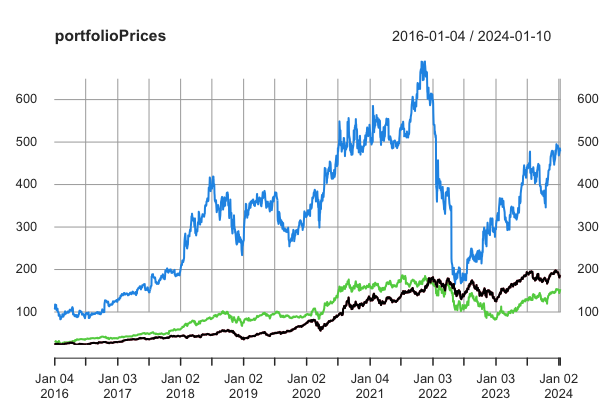
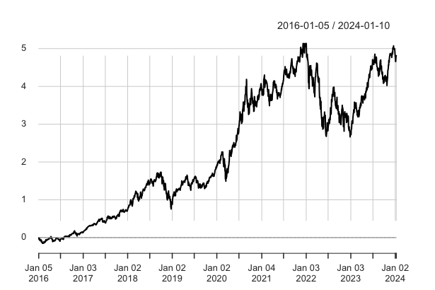
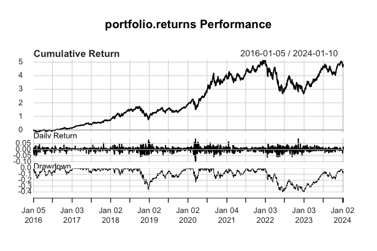

# Data Analysis - Stock Portfolio

The R script uses the **dplyr**, **quantmod**, **PerformanceAnalytics**, **imputeTS**, and **PortfolioAnalytics** libraries. If they are not installed on your machine, a function will install them at the beginning of the script.

## Analysis Objective
The goal of the analysis is to evaluate the performance of a financial portfolio composed of stocks from different companies, represented by their tickers (stock symbols). The R script uses various libraries to collect historical price data for the stocks and then performs a series of analyses and calculations to assess the portfolio returns relative to a benchmark index, typically represented by the S&P 500 ETF (symbol "SPY").

## Definition of Tickers and Portfolio Weights:
The tickers (symbols) of financial assets in the portfolio are defined in the **tickers** vector.

The weights associated with each financial asset are defined in the **weights** vector.

## Data Collection
A **for** loop iterates through each ticker, uses the **getSymbols.yahoo** function from the **quantmod** library to retrieve price data from Yahoo Finance, and then concatenates the columns into the **portfolioPrices** variable. Price data for the benchmark index (benchmark), in this case, "SPY" (S&P 500 ETF), is also collected.

## Data Analysis
Preliminary analyses are conducted to check for the presence of missing values in the price data **(colSums(is.na(...)))**. Returns of prices are calculated using the **ROC** function for both the portfolio and the benchmark index.

## Data Manipulation
Column names of **portfolioPrices** are changed to match the tickers. The prices of each financial asset are then displayed.

## Calculation of Portfolio Returns
Daily returns of the portfolio are calculated from the price data.

## Calculation of Portfolio Performance
The performance of the portfolio is calculated using the **Return.portfolio** function from the **PortfolioAnalytics** library.

Graphs of cumulative returns and performance statistics are displayed.

## Calculation of Performance Metrics
Performance metrics, such as CAPM beta, Jensen's alpha, Sharpe ratio, and annualized returns, are calculated and displayed.

## Conclusion
The conclusion of this analysis suggests that the financial portfolio, composed of stocks from different companies, underwent a detailed evaluation of its historical performance. The main steps of the analysis included data collection and manipulation, analysis of daily returns, calculation of portfolio performance relative to a benchmark index, and assessment of various performance metrics.

Graphs of cumulative returns provided a clear visualization of the portfolio's evolution over time. Metrics such as CAPM beta, Jensen's alpha, and Sharpe ratio provided insights into the portfolio's ability to generate risk-adjusted returns.

These analyses are crucial for investors and portfolio managers as they provide insights into the portfolio's past profitability and help evaluate its performance relative to a benchmark index. This information can be used as a basis for making informed decisions about portfolio management and adjusting investment strategies based on trends and past performance.

It is essential to note that financial analysis is an ongoing process, and the results of this evaluation can guide future actions to optimize portfolio performance in a dynamic financial environment.
