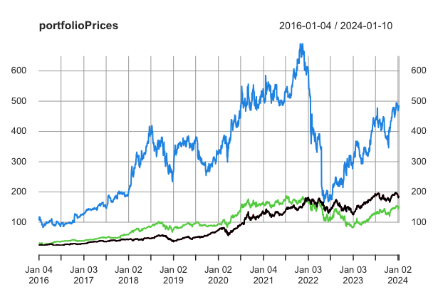
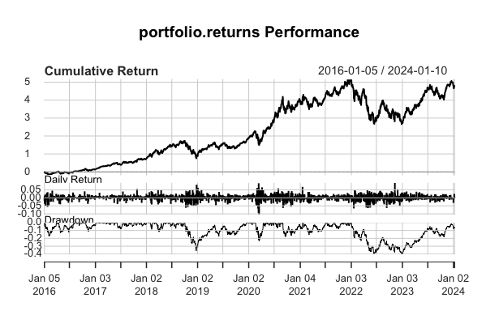

# Analyse de données - Portfolio d'actions

Le script R utilise les bibliothèques **dplyr**, **quantmod**, **PerformanceAnalytics**, **imputeTS** et **PortfolioAnalytics**. Si elles ne sont pas installées sur votre machine, une fonction les installera au début du script.

## Objectif de l'analyse
L'objectif de l'analyse est d'évaluer la performance d'un portefeuille financier composé d'actions de différentes entreprises, représentées par leurs tickers (symboles boursiers). Le script R utilise diverses librairies pour collecter les données historiques de prix des actions, puis effectue une série d'analyses et de calculs pour évaluer les rendements du portefeuille par rapport à un indice de référence, généralement représenté par l'ETF S&P 500 (symbole "SPY").

## Définition des tickers et poids du portefeuille :
Les tickers (symboles) des actifs financiers dans le portefeuille sont définis dans le vecteur **tickers**.

Les poids associés à chaque actif financier sont définis dans le vecteur **weights**.

## Collecte des données
Une boucle **fo**r parcourt chaque ticker, utilise la fonction **getSymbols.yahoo** de la librairie **quantmod** pour récupérer les données de prix depuis Yahoo Finance, puis concatène les colonnes dans la variable **portfolioPrices**.
Les données de prix pour l'indice de référence (benchmark), dans ce cas, "SPY" (ETF S&P 500), sont également collectées.

## Analyse des donneées
Des analyses préliminaires sont effectuées pour vérifier la présence de valeurs manquantes dans les données de prix **(colSums(is.na(...)))**.
Les retours (returns) des prix sont calculés à l'aide de la fonction **ROC** pour le portefeuille et l'indice de référence.

## Manipulation des données
Les noms de colonnes de **portfolioPrices** sont modifiés pour correspondre aux tickers.
On affiche ensuite les prix de chaque actif financier est affiché.

## Calcul des retours du portefeuille
Les retours quotidiens du portefeuille sont calculés à partir des données de prix.

## Calcul des performances du portefeuille
Les performances du portefeuille sont calculées à l'aide de la fonction **Return.portfolio** de la librairie **PortfolioAnalytics**.

Des graphiques des rendements cumulés et des statistiques de performance sont affichés

## Calcul de métriques de performance
Des métriques de performance, tels que le bêta CAPM, l'alpha Jensen, le ratio de Sharpe, et des rendements annualisés, sont calculées et affichées

## Conclusion
La conclusion de cette analyse suggère que le portefeuille financier, composé d'actions de différentes entreprises, a été soumis à une évaluation détaillée de sa performance historique. Les principales étapes de l'analyse ont inclus la collecte et la manipulation des données, l'analyse des rendements quotidiens, le calcul des performances du portefeuille par rapport à un indice de référence, et l'évaluation de diverses métriques de performance.

Les graphiques des rendements cumulés ont fourni une visualisation claire de l'évolution du portefeuille au fil du temps. Les métriques telles que le bêta CAPM, l'alpha Jensen et le ratio de Sharpe ont permis d'obtenir des indications sur la capacité du portefeuille à générer des rendements ajustés au risque.

Ces analyses sont cruciales pour les investisseurs et les gestionnaires de portefeuille, car elles offrent des perspectives sur la rentabilité passée du portefeuille et aident à évaluer sa performance par rapport à un indice de référence. Cela peut être utilisé comme base pour prendre des décisions éclairées sur la gestion du portefeuille et ajuster la stratégie d'investissement en fonction des tendances et des performances passées.

Il est important de noter que l'analyse financière est un processus continu, et les résultats de cette évaluation peuvent guider les actions futures pour optimiser la performance du portefeuille dans un environnement financier dynamique.
